# Smart Bug Reporting & Ticketing

A gym owner shouldn't have to write "the app is broken" — the system should **automatically capture everything needed** to diagnose the issue.

---

## Recommended Stack

| Layer                 | Tool                                                  | Why                                                                   |
| --------------------- | ----------------------------------------------------- | --------------------------------------------------------------------- |
| **In-App Capture**    | Custom built-in reporter                              | Captures screenshots, device info, logs — zero friction for users     |
| **Ticketing Backend** | [GitHub Issues](https://github.com/features/issues)   | Free, already integrated with your repos, has API, labels, milestones |
| **Error Tracking**    | [Sentry](https://sentry.io) (free tier: 5K events/mo) | Auto-captures crashes, stack traces, breadcrumbs, performance         |
| **Escalation**        | GitHub Projects board                                 | Kanban-style triage with auto-assignment                              |

:::tip Why not Jira/Linear/etc.?
You're already on GitHub. Using GitHub Issues means **zero context switching** — bugs link directly to PRs, commits, and deployments. The API is free and unlimited. If you outgrow it, you can migrate to Linear later since they import from GitHub natively.
:::

---

## Architecture

```mermaid
flowchart TD
    subgraph "User Devices"
        Mobile["📱 Mobile App"]
        Admin["🖥️ Gym Admin"]
    end

    subgraph "Automatic Capture"
        Sentry["Sentry SDK"]
        Reporter["In-App Reporter"]
    end

    subgraph "Processing"
        API["FitNexa API"]
        GH["GitHub Issues API"]
    end

    subgraph "Triage"
        Board["GitHub Projects Board"]
        Notify["Slack / Email Alert"]
    end

    Mobile --> Sentry
    Admin --> Sentry
    Mobile --> Reporter
    Admin --> Reporter
    Sentry -- "crashes, errors" --> GH
    Reporter -- "user reports" --> API
    API -- "creates issue" --> GH
    GH --> Board
    GH --> Notify
```



---

## In-App Reporter (What the user sees)

### Mobile App

A **shake-to-report** gesture or a "Report Bug" button in settings that:

1. Takes a screenshot automatically
2. Captures device context (OS, app version, screen name, memory, battery)
3. Attaches the last 50 log entries from the local log buffer
4. Shows a simple form: **What happened?** (text) + **Severity** (🟢 Minor / 🟡 Annoying / 🔴 Broken)
5. Submits everything to the API

```typescript
// React Native — shake to report
import RNShake from 'react-native-shake';

RNShake.addListener(() => {
  const context = {
    screen: navigation.getCurrentRoute()?.name,
    appVersion: Constants.expoConfig?.version,
    os: `${Platform.OS} ${Platform.Version}`,
    locale: i18n.language,
    userId: auth.user?.id,
    gymId: auth.user?.gymId,
  };
  openBugReporter(context);
});
```

### Admin Panel

A floating **🐛 Report Bug** button (bottom-right) that:

1. Takes a DOM screenshot via `html2canvas`
2. Captures browser info, current URL, user role, gym context
3. Attaches recent API errors from an in-memory error buffer
4. Opens a minimal modal: description + severity

---

## Auto-Context Payload

Every bug report automatically includes:

```json
{
  "title": "User report: Can't load challenges",
  "description": "The challenges page shows a spinner forever",
  "severity": "high",
  "context": {
    "platform": "mobile",
    "appVersion": "2.1.0",
    "os": "iOS 18.2",
    "device": "iPhone 15",
    "screen": "ChallengesScreen",
    "locale": "it",
    "userId": "u_abc123",
    "gymId": "iron-temple",
    "correlationId": "corr_xyz789",
    "timestamp": "2026-02-14T15:50:00Z"
  },
  "recentErrors": [
    { "endpoint": "GET /gym/challenges", "status": 500, "correlationId": "corr_xyz789" }
  ],
  "screenshot": "base64://..."
}
```

---

## API → GitHub Issues

The FitNexa API receives the report and creates a GitHub Issue automatically:

```typescript
// POST /v1/bug-reports → creates GitHub Issue
const issue = await octokit.issues.create({
  owner: 'FitNexa',
  repo: 'fitnexa-backend',  // or route to correct repo
  title: `[BUG] ${report.title}`,
  body: formatIssueBody(report),
  labels: [
    `severity:${report.severity}`,
    `platform:${report.context.platform}`,
    `gym:${report.context.gymId}`,
    'source:in-app'
  ],
});
```

### Generated Issue Body

The API formats the issue as a clean, searchable GitHub issue:

```markdown
## Bug Report (In-App)

**Reporter:** u_abc123 (iron-temple)
**Severity:** 🔴 High
**Platform:** iOS 18.2, iPhone 15, App v2.1.0

### Description
The challenges page shows a spinner forever

### Context
| Field          | Value            |
| -------------- | ---------------- |
| Screen         | ChallengesScreen |
| Locale         | it               |
| Correlation ID | `corr_xyz789`    |

### Recent API Errors
- `GET /gym/challenges` → 500 (corr_xyz789)

### Screenshot

```

---

## Sentry Integration (Automatic Crashes)

Sentry catches crashes the user **doesn't even know about:**

### Mobile (Expo)

```bash
npx expo install @sentry/react-native
```

```typescript
import * as Sentry from '@sentry/react-native';

Sentry.init({
  dsn: 'https://xxx@sentry.io/xxx',
  environment: __DEV__ ? 'development' : 'production',
  tracesSampleRate: 0.2,
});

// Tag every event with gym context
Sentry.setUser({ id: user.id, email: user.email });
Sentry.setTag('gymId', user.gymId);
```

### Admin Panel (React)

```bash
npm install @sentry/react
```

```typescript
import * as Sentry from '@sentry/react';

Sentry.init({
  dsn: 'https://xxx@sentry.io/xxx',
  integrations: [Sentry.browserTracingIntegration()],
  tracesSampleRate: 0.2,
});
```

### Sentry → GitHub Auto-Link

Sentry natively integrates with GitHub — every crash auto-creates or links to a GitHub Issue with full stack trace.

---

## Triage Workflow

```mermaid
flowchart LR
    New["🆕 New Issue"] --> Triage{"Auto-label by severity"}
    Triage -->|🔴 High/Critical| Urgent["⚡ Urgent Column\n+ Slack alert"]
    Triage -->|🟡 Medium| Backlog["📋 Backlog Column"]
    Triage -->|🟢 Low| Icebox["🧊 Icebox Column"]
    Urgent --> Fix["🔧 In Progress"]
    Fix --> PR["Pull Request"]
    PR --> Close["✅ Closed"]
```



**Auto-assignment rules** (via GitHub Actions):

| Label               | Action                                       |
| ------------------- | -------------------------------------------- |
| `severity:critical` | Assign to on-call dev, post to Slack `#bugs` |
| `platform:mobile`   | Assign to mobile team                        |
| `platform:admin`    | Assign to web team                           |
| `gym:*`             | Tag the gym's account manager                |

---

## Why This Works

| Problem                    | Solution                                              |
| -------------------------- | ----------------------------------------------------- |
| Users can't describe bugs  | Auto-capture screenshot + device + logs               |
| "Works on my machine"      | correlationId links to exact server-side logs         |
| Bugs get lost              | GitHub Issues = searchable, trackable, linked to PRs  |
| No prioritization          | Auto-labeling + Kanban board + Slack alerts           |
| Crashes users don't report | Sentry catches them silently                          |
| Cost                       | GitHub Issues = free, Sentry free tier = 5K events/mo |

---

Related: [Third-Party Integration](./third-party-integration) · [Backend Error Handling](../backend/error-handling) · [Production Readiness](../production-readiness/overview)
