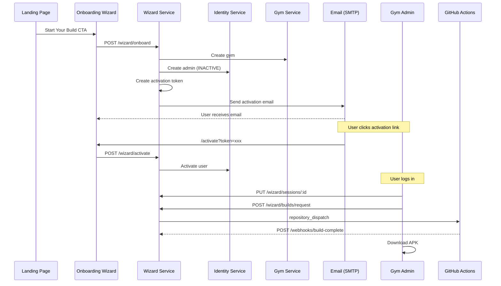

# Gym Onboarding Flow

The gym onboarding flow is the core conversion pipeline of FitNexa. It takes a potential gym client from their first visit on the landing page all the way through to downloading a branded, testable Android APK of their own gym app.

## Overview

## Step 1 - Landing Page Preview

**App**: `fitnexa-landing`

The landing page features an interactive **BrandPreview** component where visitors can:

- Enter a gym name
- Pick a primary colour (6 presets or custom hex)
- Toggle between mobile and desktop preview
- See a live mockup of both the branded mobile app and the admin dashboard

A **How It Works** section below the preview shows the four-step journey:

1. Build Your Brand
2. Complete Onboarding
3. Customise in Dashboard
4. Generate and Test APK

A "Start Building Now" CTA button passes the chosen `gymName` and `primaryColor` as query params to the onboarding wizard.

**Key files**: `src/components/BrandPreview.tsx`, `src/pages/Home.tsx`

## Step 2 - Onboarding Wizard

**App**: `fitnexa-admin/onboarding`

A multi-step wizard collects everything needed to create a new gym:

| Step | Fields |
|------|--------|
| 1. Gym Identity | Name, type, address |
| 2. Branding | Primary colour (pre-populated from landing) |
| 3. Features | Toggle modules: nutrition, squads, challenges, workouts, check-in, marketing |
| 4. Admin Account | Name, email, phone |

On submit the frontend calls `POST /wizard/onboard`.

**Key files**: `src/features/onboarding/components/OnboardingWizard.tsx`, `src/features/onboarding/context/OnboardingContext.tsx`

## Step 3 - Backend Orchestration

**Service**: `wizard-service`

The `OnboardingOrchestrator` executes the following in order:

1. **Create gym** via `GymServiceClient.createGym()` with branding config
2. **Create admin user** via `IdentityServiceClient.createGymAdmin()` with status `INACTIVE`
3. **Generate activation token** (random 64-char hex, 24h expiry)
4. **Create wizard session** (persists all onboarding data as JSON)
5. **Send activation email** via `MailjetEmailService` (Mailjet API)

If admin creation fails, the orchestrator compensates by deleting the gym (saga pattern).

### Email Service

The `MailjetEmailService` uses the Mailjet API to send two types of emails:

- **Activation email**: Contains a styled HTML button linking to the activation page
- **Welcome email**: Sent after activation, links to the gym admin dashboard

When `MJ_APIKEY_PUBLIC` and `MJ_APIKEY_PRIVATE` (Mailjet) are not set, the service falls back to `MockEmailService` which logs to console.

### GitHub Build Service

## Step 4 - Account Activation

The activation email contains an HTML template with a button linking to the onboarding app's activation route with the token as a query parameter.

The activation page:

1. Validates the token via `GET /wizard/activate/:token`
2. Lets the user set a password
3. Activates the account via `POST /wizard/activate`
4. Redirects to the gym admin login page

## Step 5 - Gym Admin Dashboard

**App**: `fitnexa-admin/gym-admin`

After login, the gym admin sees their personalised dashboard.

### Dashboard

- Overview widgets (occupancy, members, check-ins, revenue)
- **WizardReview** component showing build status

### Gym Setup Page

Located at `/:gymId/setup`. Provides a tabbed editor with three sections:

| Tab | Fields |
|-----|--------|
| Branding | Gym name, primary/secondary colour (10 presets plus custom), logo URL with live preview |
| Features | Toggle 8 modules (nutrition, squads, challenges, workouts, check-in, marketing, store, AI scanner) |
| Connections | Instagram, Facebook, support email |

Changes are saved to the wizard session via `PUT /wizard/sessions/:id`.

**Key files**: `src/features/onboarding/components/GymSetup.tsx`, `src/shared/components/Layout.tsx`

### Mobile App Build

The **WizardReview** component lets the admin:

- Click "Request UAT Build" to trigger an APK build
- See real-time build status (polls every 8 seconds while QUEUED or BUILDING)
- Download the APK or scan a QR code when the build succeeds
- Click "Go Live" to enter Stripe checkout for production deployment

## Step 6 - APK Build Pipeline

### Trigger

- `gymId` - target gym identifier
- `buildId` - unique build request ID
- `callbackUrl` - webhook URL for the build to report back to
- `apiUrl` - API base URL for fetching gym branding

### Build Workflow

The `uat-build.yml` workflow in the `fitnexa-mobile` repo:

1. Sets up Node.js 20 and Java 17
2. Installs dependencies
3. Fetches gym branding from the API
4. Runs `expo prebuild --platform android`
5. Builds APK via Gradle (`assembleRelease`)
6. Uploads artifact to GitHub Actions
7. Calls the callback URL with status and artifact URL

### Webhook

`POST /wizard/webhooks/build-complete` receives the callback and updates the `BuildRequest` record with:

- `status`: SUCCESS or FAILED
- `buildUrl`: GitHub Actions artifact download URL
- `completedAt`: timestamp

The gym admin polling picks up the status change and shows the download button.

---

## Environment Variables

### Wizard Service

| Variable | Required | Description |
|----------|----------|-------------|
| `MJ_APIKEY_PUBLIC` | For email | Mailjet API key (public) |
| `MJ_APIKEY_PRIVATE` | For email | Mailjet API secret (private). If either key is unset, falls back to mock. |
| `MJ_FROM` | For email | Sender address (default: FitNexa &lt;noreply@gymia.fit&gt;) |
| `GITHUB_TOKEN` | For builds | GitHub PAT with repo scope. If unset, falls back to mock. |
| `GITHUB_REPO_OWNER` | No | GitHub org (default: FitNexa) |
| `GITHUB_REPO_NAME` | No | Repo containing uat-build.yml (default: fitnexa-mobile) |
| `GITHUB_CALLBACK_URL` | No | Override webhook base URL (default: uses API_URL) |
| `GYM_ADMIN_URL` | No | Welcome email link (default: https://admin.uat.gymia.fit) |
| `FRONTEND_URL` | No | Activation link base (default: https://onboarding.uat.gymia.fit) |

---

## API Endpoints

| Method | Path | Auth | Description |
|--------|------|------|-------------|
| POST | `/wizard/onboard` | None | Submit onboarding data |
| GET | `/wizard/activate/:token` | None | Validate activation token |
| POST | `/wizard/activate` | None | Set password and activate |
| GET | `/wizard/sessions` | JWT | List wizard sessions |
| GET | `/wizard/sessions/:id` | Optional | Get session by ID |
| PUT | `/wizard/sessions/:id` | Optional | Update session data |
| POST | `/wizard/builds/request` | JWT | Request a UAT APK build |
| GET | `/wizard/builds/:id/status` | JWT | Get build status |
| GET | `/wizard/builds/gym/:gymId` | JWT | List builds for a gym |
| POST | `/wizard/builds/:id/go-live` | JWT | Create Stripe checkout |
| POST | `/wizard/webhooks/build-complete` | None | GitHub Actions callback |

---

## Database Models

### WizardSession

| Field | Type | Description |
|-------|------|-------------|
| id | UUID | Primary key |
| gymId | String (nullable) | Associated gym |
| name | String | Session label |
| step | Int | Current wizard step |
| data | String (JSON) | Encoded GymConfig object |
| status | Enum | IN_PROGRESS, COMPLETED, DRAFT, PENDING_APPROVAL, REJECTED |

### ActivationToken

| Field | Type | Description |
|-------|------|-------------|
| id | UUID | Primary key |
| userId | String | References identity-service user |
| token | String | Unique 64-char hex |
| expiresAt | DateTime | 24 hours from creation |
| usedAt | DateTime (nullable) | Set when activated |

### BuildRequest

| Field | Type | Description |
|-------|------|-------------|
| id | UUID | Primary key |
| gymId | String | Target gym |
| platform | String | android, ios, or both |
| environment | String | uat or production |
| status | Enum | QUEUED, BUILDING, SUCCESS, FAILED |
| buildUrl | String (nullable) | Artifact download URL |
| triggeredBy | String | User ID who requested |

---

Related: [Wizard Service](../backend/services/wizard-service.md) | [Gym Admin](../frontend/apps/gym-admin.md) | [Onboarding App](../frontend/apps/onboarding.md) | [Landing Page](../frontend/apps/landing.md)
