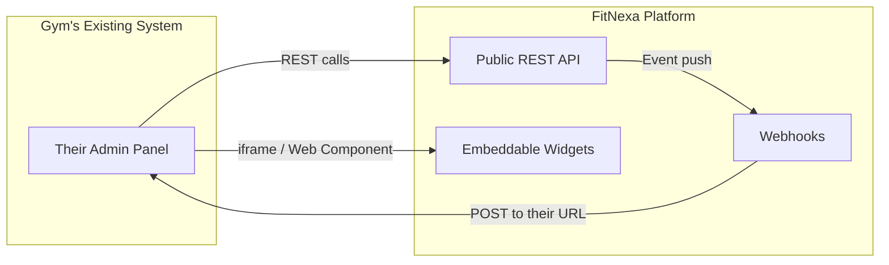
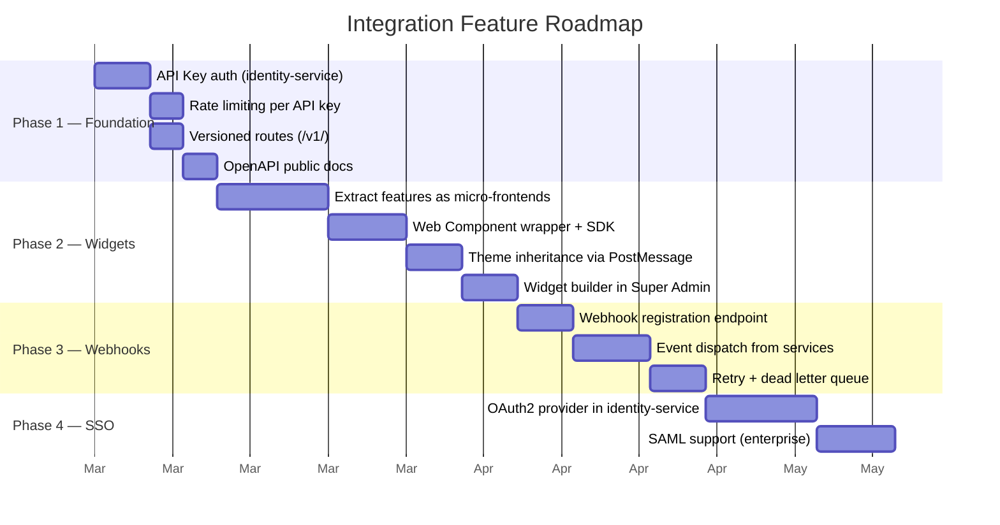

# Third-Party Integration Strategy

Gyms that already use admin software (Mindbody, Glofox, ClubReady, etc.) won't switch entirely. FitNexa must let them **pick and choose** features as add-ons — without replacing their existing panel.

## Integration Strategies (Ranked)



---

## Strategy 1: Public REST API + API Keys

**What:** Expose a documented, versioned API with per-gym API keys so their existing admin panel can call FitNexa directly.

```bash
POST https://api.gymia.fit/v1/challenges
Authorization: Bearer gym_api_key_xxx
Content-Type: application/json

{ "title": "January Push-up Challenge", "goal": 1000, "type": "total_workouts" }
```

### What needs to be built

| Component             | Description                                                 |
| --------------------- | ----------------------------------------------------------- |
| API Key management    | Per-gym keys in `identity-service`, separate from user JWTs |
| Rate limiting per key | Prevent abuse per API key, not just per IP                  |
| Versioned endpoints   | `/v1/` prefix so integrations never break                   |
| Public OpenAPI docs   | Published at `https://docs.gymia.fit/api`                   |

:::tip Best for
Gyms with dev teams or IT staff who can integrate APIs directly.
:::

---

## Strategy 2: Embeddable Widgets

**What:** Package FitNexa features as standalone `<iframe>` widgets or Web Components that drop into ANY admin panel with 2 lines of code.

### Usage (Web Component)

```html
<script src="https://widgets.gymia.fit/sdk.js"></script>
<fitnexa-challenges gym-id="iron-temple" api-key="gk_xxx"></fitnexa-challenges>
```

### Usage (iframe)

```html
<iframe
  src="https://widgets.gymia.fit/challenges?gym=iron-temple&key=gk_xxx"
  style="width:100%;height:600px;border:none;">
</iframe>
```

### Available Widgets

| Widget                 | What it embeds                       |
| ---------------------- | ------------------------------------ |
| `<fitnexa-challenges>` | Monthly challenges dashboard         |
| `<fitnexa-checkins>`   | Real-time check-in feed + QR scanner |
| `<fitnexa-members>`    | Member list with search/filter       |
| `<fitnexa-nutrition>`  | Nutrition AI + meal plans            |
| `<fitnexa-messaging>`  | Member inbox                         |
| `<fitnexa-analytics>`  | Dashboard charts                     |

### Architecture

The Gym Admin is already a React app — each page can be extracted into a standalone micro-frontend that runs either inside the full admin OR as an embedded widget.

**Required components:**

- `fitnexa-widgets` package wrapping each feature in a Web Component or iframe
- PostMessage API for the host page to communicate (theme, auth, events)
- Theme inheritance — widget reads host CSS variables or accepts theme props
- Widget builder in Super Admin: "Generate embed code for [Feature]"

:::tip Best for
The largest market — gyms without dev teams can copy-paste an embed code into any platform.
:::

---

## Strategy 3: Webhooks + Event Subscriptions

**What:** FitNexa pushes real-time events to the gym's existing systems for two-way sync.

### Registration

```json
POST https://api.gymia.fit/v1/webhooks
{
  "url": "https://their-system.com/fitnexa-events",
  "events": ["member.checked_in", "challenge.completed", "member.registered"],
  "secret": "whsec_xxx"
}
```

### Event Payload

```json
{
  "event": "member.checked_in",
  "timestamp": "2026-02-14T15:00:00Z",
  "data": {
    "memberId": "u123",
    "locationId": "l1",
    "gymId": "iron-temple"
  },
  "signature": "sha256=abc..."
}
```

### Supported Events

| Event                  | Trigger                       |
| ---------------------- | ----------------------------- |
| `member.registered`    | New member signs up           |
| `member.checked_in`    | Member scans QR code          |
| `challenge.completed`  | Member finishes a challenge   |
| `challenge.created`    | Admin creates a new challenge |
| `workout.completed`    | Member logs a workout         |
| `subscription.changed` | Membership tier changes       |

:::tip Best for
Enterprise customers, CRM sync, billing system integration. Their system reacts to FitNexa events in real time.
:::

---

## Implementation Roadmap



| Phase       | What                  | Unlocks                                               |
| ----------- | --------------------- | ----------------------------------------------------- |
| **Phase 1** | Public API + API Keys | Everything else — widgets and webhooks depend on this |
| **Phase 2** | Embeddable Widgets    | Biggest market reach — copy-paste integration         |
| **Phase 3** | Webhooks              | Enterprise two-way sync                               |
| **Phase 4** | OAuth2 / SSO          | Single sign-on from their systems into FitNexa        |

---

Related: [Backend Architecture](../backend/architecture) · [API Client](../frontend/api-client) · [Services Catalog](../backend/services-catalog)
