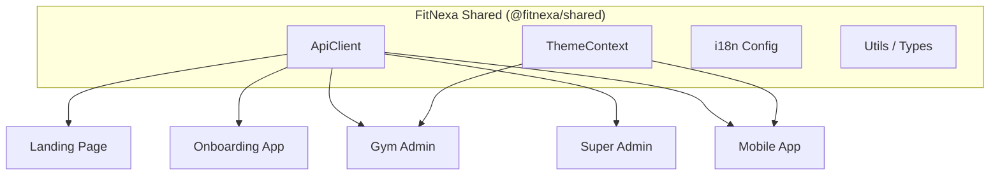

# Frontend Overview

FitNexa features a diverse set of frontend applications using modern reactive frameworks, all sharing a common design system and API client.

## 📦 Application Matrix

| App              | Stack                | Port | Deployment | Status       |
| ---------------- | -------------------- | ---- | ---------- | ------------ |
| **Landing Page** | Vite + React + TW v4 | 5174 | Vercel     | ✅ Production |
| **Gym Admin**    | Vite + React + TW v3 | 3001 | Vercel     | ✅ Production |
| **Super Admin**  | Vite + React + TW v3 | 5173 | Vercel     | ✅ Production |
| **Onboarding**   | Vite + React + TW v3 | 5175 | Vercel     | 🚧 Skeleton   |
| **Mobile App**   | React Native + Expo  | 8081 | EAS Build  | ✅ Production |

## 🏗️ Common Architecture

All frontend apps share core logic through `@fitnexa/shared`:

## 🛠️ Design System
While tech stacks vary slightly (Tailwind v3 vs v4), we adhere to a universal set of design tokens defined in the **GymConfig**. 

- **Chameleon Engine**: The Gym Admin and Mobile apps fetch branding JSON and inject colors as CSS variables or React state.
- **Micro-animations**: Powered by Framer Motion in web and Reanimated in mobile.

---
Related: [API Client Guide](api-client.md) · [Internationalization](i18n.md) · [Testing](testing.md)
