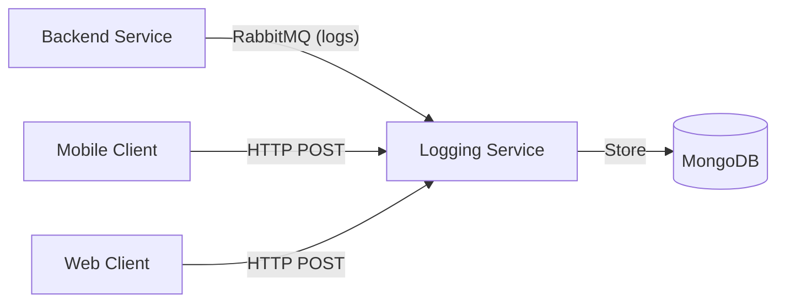

# Logging & Observability

FitNexa uses a centralized, asynchronous logging architecture to ensure platform stability and fast debugging.

## 📐 Architecture



### 1. RabbitMQ Transport
Backend services use a custom Winston transport (`RabbitMQTransport`) from `@fitnexa/shared`. 
- **Benefit**: Logging is non-blocking. If the logging database is slow, it won't slow down the API response.

### 2. HTTP Sink (Frontend)
Mobile and Web clients ship logs via a dedicated `/logs` endpoint in the **Logging Service** (Port 3009).

### 3. MongoDB Storage
Logs are stored in a document-based database. This allows for heterogeneous log structures (e.g., Mobile stack traces vs. DB slow-query logs).

## 🔍 Correlation Strategy

Every request is assigned a `correlationId` (Reference Code).
- **Backend**: Generated by the `correlationMiddleware` in `@fitnexa/shared`.
- **Mobile**: Generated by the `GlobalErrorBoundary` during crashes.

**Searching Logs**:
To find all events related to a specific failure, search by `correlationId` in MongoDB:
```javascript
db.logs.find({ correlationId: "X-CORR-1234" }).sort({ timestamp: 1 })
```

---

## 🔗 Related Links
- **[Mobile Error Handling](../mobile/ERROR_HANDLING.md)**
- **[System Overview](../SYSTEM_OVERVIEW.md)**
