# Fix Roadmap

Prioritized execution order — address critical issues first, then work down.

## Execution Order

```mermaid
gantt
    title Production Readiness Fix Order
    dateFormat X
    axisFormat %s

    section Critical
    C-1 Rate Limiting          :crit, 0, 3
    C-2 CORS Lockdown          :crit, 0, 1
    C-3 Graceful Shutdown      :crit, 1, 3
    C-4 Refresh Token DB Check :crit, 1, 2
    C-5 Svc-to-Svc Auth        :crit, 3, 5

    section High
    H-1 Required gymId         :active, 2, 3
    H-2 Zod for All Services   :active, 3, 7
    H-3 Bcrypt Rounds          :active, 2, 3
    H-4 ApiClient Timeout      :active, 3, 4
    H-5 ApiClient Token Refresh:active, 4, 6
    H-6 Prisma Pool Config     :active, 3, 4
    H-7 Error Message Sanitize :active, 4, 5

    section Medium
    M-1 Process Handlers       :5, 6
    M-2 Readiness Endpoint     :5, 7
    M-3 Logging Consistency    :6, 8
    M-4 Gateway Request Logs   :6, 7
    M-5 Prisma Migrations      :7, 9
    M-6 ApiClient Retry        :7, 8
    M-7 JWT Payload Strategy   :8, 9
```

---

## Phase Breakdown

### Phase 1: Emergency Security (Day 1)

| ID  | Fix                                                                        | Effort |
| --- | -------------------------------------------------------------------------- | ------ |
| C-1 | Install `express-rate-limit`, add to `createBaseService()` and auth routes | 2h     |
| C-2 | Replace `origin: '*'` with `ALLOWED_ORIGINS` env var in `bootstrap.ts`     | 30min  |
| H-3 | Define `BCRYPT_ROUNDS = 12` constant, apply everywhere                     | 15min  |

### Phase 2: Auth Hardening (Day 1–2)

| ID  | Fix                                                             | Effort |
| --- | --------------------------------------------------------------- | ------ |
| C-4 | Add DB lookup in `AuthService.refresh()`                        | 1h     |
| H-1 | Make `gymId` required in register schema, remove `'g1'` default | 30min  |
| H-7 | Audit all `throw new Error()` calls, replace with typed errors  | 2h     |

### Phase 3: Stability (Day 2–3)

| ID  | Fix                                                    | Effort |
| --- | ------------------------------------------------------ | ------ |
| C-3 | Add SIGTERM handler to `createBaseService()`           | 1h     |
| M-1 | Add `uncaughtException`/`unhandledRejection` handlers  | 30min  |
| H-6 | Add `connection_limit` to DATABASE_URL across services | 30min  |
| L-3 | Guard seed data behind `NODE_ENV === 'development'`    | 15min  |

### Phase 4: Client Resilience (Day 3–4)

| ID  | Fix                                                       | Effort |
| --- | --------------------------------------------------------- | ------ |
| H-4 | Add `AbortController` timeout (15s) to ApiClient          | 1h     |
| H-5 | Add `onUnauthorized` callback for automatic token refresh | 2h     |
| M-6 | Add exponential backoff retry for 5xx/network errors      | 1h     |

### Phase 5: Observability (Day 4–5)

| ID  | Fix                                                            | Effort |
| --- | -------------------------------------------------------------- | ------ |
| M-3 | Add ESLint rule banning console.log, standardize error logging | 1h     |
| M-4 | Add request logging middleware to gateway                      | 1h     |
| M-2 | Add `/ready` endpoint to `createBaseService()` with DB check   | 1h     |
| L-1 | Forward `X-Correlation-Id` through gateway proxy               | 30min  |

### Phase 6: Infrastructure (Day 5+)

| ID  | Fix                                                      | Effort |
| --- | -------------------------------------------------------- | ------ |
| C-5 | Implement `INTERNAL_API_KEY` for service-to-service auth | 2h     |
| H-2 | Create Zod schemas for remaining 6 services              | 4h     |
| M-5 | Switch from `prisma db push` to `prisma migrate`         | 2h     |

---

## Estimated Total Effort

| Phase                       | Effort     | Priority                 |
| --------------------------- | ---------- | ------------------------ |
| Phase 1: Emergency Security | **~3h**    | Do immediately           |
| Phase 2: Auth Hardening     | **~3.5h**  | Before any user testing  |
| Phase 3: Stability          | **~2.5h**  | Before production deploy |
| Phase 4: Client Resilience  | **~4h**    | Before production deploy |
| Phase 5: Observability      | **~3.5h**  | Within first week        |
| Phase 6: Infrastructure     | **~8h**    | Within first month       |
| **Total**                   | **~24.5h** |                          |

---

Related: [Audit Overview](./overview.md) · [Security Findings](./security.md) · [Stability Findings](./stability.md) · [Observability & Quality](./observability-quality.md)
